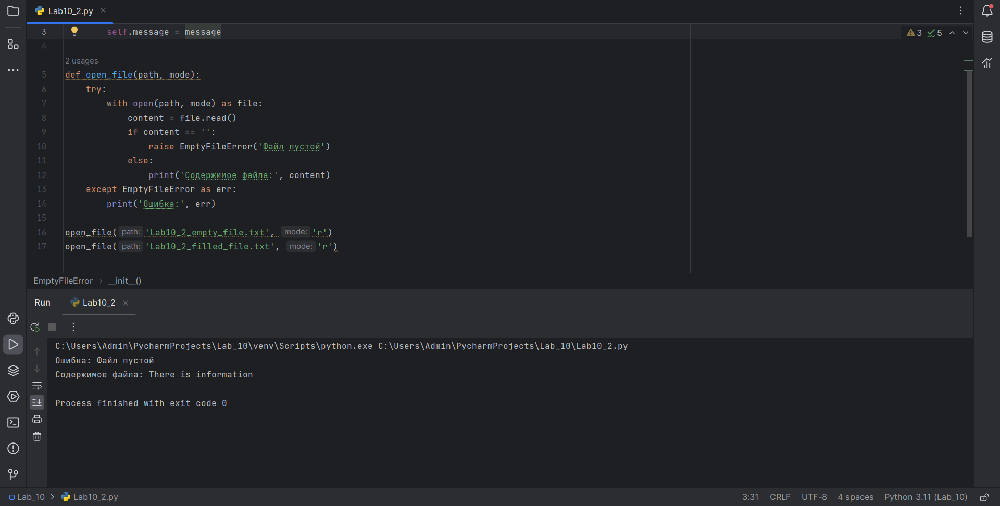
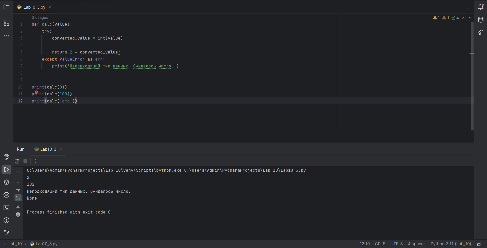
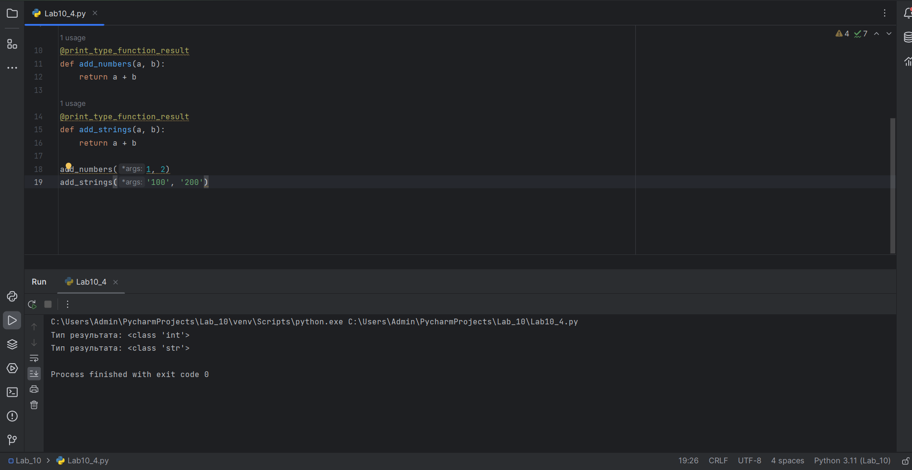

# Тема 10. Декораторы и исключения
Отчет по Теме #10 выполнил(а):
- Плотников Иван Сергеевичч
- ЗПИЭ-20-1

| Задание   | Сам_раб |
|-----------|---------|
| Задание 1 | +       |
| Задание 2 | +       |
| Задание 3 | +       |
| Задание 4 | +       |
| Задание 5 | +       |

знак "+" - задание выполнено; знак "-" - задание не выполнено;

Работу проверили:
- к.э.н., доцент Панов М.А.

## Самостоятельная работа №1
### Вовочка решил заняться спортивным программированием на python, но для этого он должен знать за какое время выполняется его программа. Он решил, что для этого ему идеально подойдет декоратор для функции, который будет выяснять за какое время выполняется та или иная функция. Помогите Вовочке в его начинаниях и напишите такой декоратор.

```python
import time
def mesuare_time(func):
    def wrapper(*args, **kwargs):
        start_time = time.time()
        result = func(*args, **kwargs)
        end_time = time.time()
        execution_time = end_time - start_time
        print(f'\nВремя выполнения: {execution_time} секунд')
        return result
    return wrapper
@mesuare_time
def fibonacci():
    fib1 = fib2 = 1
    for i in range(2, 200):
        fib1, fib2 = fib2, fib1 + fib2
        print(fib2, end=' ')

if __name__ == '__main__':
    fibonacci()
```

### Результат.


## Выводы

Благодаря использованию функции `mesuare_time()` в виде декоратора можно замерять время выполнения других функций

## Самостоятельная работа №2
### Посмотрев на Вовочку, вы также загорелись идеей спортивного программирования, начав тренировки вы узнали, что для решения некоторых задач необходимо считывать данные из файлов. Но через некоторое время вы столкнулись с проблемой что файлы бывают пустыми, и вы не получаете вводные данные для решения задачи. После этого вы решили не просто считывать данные из файла, а всю конструкцию оборачивать в исключения, чтобы избежать такой проблемы. Создайте пустой файл и файл, в котором есть какая-то информация. Напишите код программы. Если файл пустой, то, нужно вызвать исключение (“бросить исключение”) и вывести в консоль “файл пустой”, а если он не пустой, то вывести информацию из файла.

```python
class EmptyFileError(Exception):
    def __init__(self, message):
        self.message = message

def open_file(path, mode):
    try:
        with open(path, mode) as file:
            content = file.read()
            if content == '':
                raise EmptyFileError('Файл пустой')
            else:
                print('Содержимое файла:', content)
    except EmptyFileError as err:
        print('Ошибка:', err)

open_file('./Tema10_2_empty_file.txt', 'r')
open_file('./Tema10_2_filled_file.txt', 'r')
```

### Результат.



## Выводы

Благодаря возможности выбрасывать исключение можно более информативно управлять поведением программы

## Самостоятельная работа №3
### Напишите функцию, которая будет складывать 2 и введенное пользователем число, но если пользователь введет строку или другой неподходящий тип данных, то в консоль выведется ошибка “Неподходящий тип данных. Ожидалось число.”. Реализовать функционал программы необходимо через try/except и подобрать правильный тип исключения. Создавать собственное исключение нельзя. Проведите несколько тестов, в которых исключение вызывается и нет. Результатом выполнения задачи будет листинг кода и получившийся вывод в консоль

```python
def calc(value):
    try:
        converted_value = int(value)

        return 2 + converted_value;
    except ValueError as err:
        print('Неподходящий тип данных. Ожидалось число.')


print(calc(0))
print(calc(100))
print(calc('сто'))
```

### Результат.



## Выводы

С помощью конкретного исключения `ValueError` удалось более точно обработать ошибку

## Самостоятельная работа №4
### Создайте собственный декоратор, который будет использоваться для двух любых вами придуманных функций. Декораторы, которые использовались ранее в работе нельзя воссоздавать. Результатом выполнения задачи будет: класс декоратора, две как-то связанными с ним функциями, скриншот консоли с выполненной программой и подробные комментарии, которые будут описывать работу вашего кода.

```python
# декоратор выводит тип значения,
# которое возвращено функцией
def print_type_function_result(func):
    def wrapper(*args, **kwargs):
        result = func(*args, **kwargs)
        print('Тип результата:', type(result))
        return result
    return wrapper

@print_type_function_result
def add_numbers(a, b):
    return a + b

@print_type_function_result
def add_strings(a, b):
    return a + b

add_numbers(1, 2)
add_strings('100', '200')
```

### Результат.



## Выводы

С помощью декоратора можно проверить тип значений возвращаемой функции

## Самостоятельная работа №5
### Создайте собственное исключение, которое будет использоваться в двух любых фрагментах кода. Исключения, которые использовались ранее в работе нельзя воссоздавать. Результатом выполнения задачи будет: класс исключения, код к котором в двух местах используется это исключение, скриншот консоли с выполненной программой и подробные комментарии, которые будут описывать работу вашего кода.

```python
# создана кастомная ошибка которая будет
# выбрасываться если длина имени введена неккоректной 
class NameLengthError(Exception):
    def __init__(self, message):
        self.message = message

def lower_case_username(value):
    if len(value) < 3:
        raise NameLengthError('Длина имени должна быть больше 2-ух символов')

class Student:
    def __init__(self, name, age):
        self.name = lower_case_username(name)
        self.age = age

try:
    lower_case_username('Ли')
except NameLengthError as err:
    print('Ошибка:', err)

try:
    Student('Ли', 25)
except NameLengthError as err:
    print('Ошибка:', err)

try:
    Student('Лии', 25)
except NameLengthError as err:
    print('Ошибка:', err)
finally:
    print('Учётная запись студента создана успешно')
```

### Результат.


## Выводы

Благодаря кастомным ошибкам можно выдавать более информативные сообщения

## Общие выводы по теме

При выполнении задания я узнал, что декораторы в Python позволяют добавлять для функций дополнительную функциональность не меняя саму функцию.
Исключения позволяют более грамотно управлять программой и сообщать о том, что что-то пошло не так.