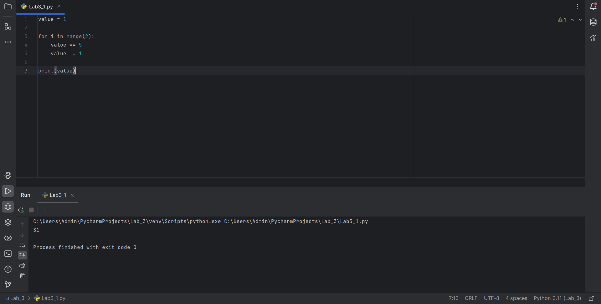
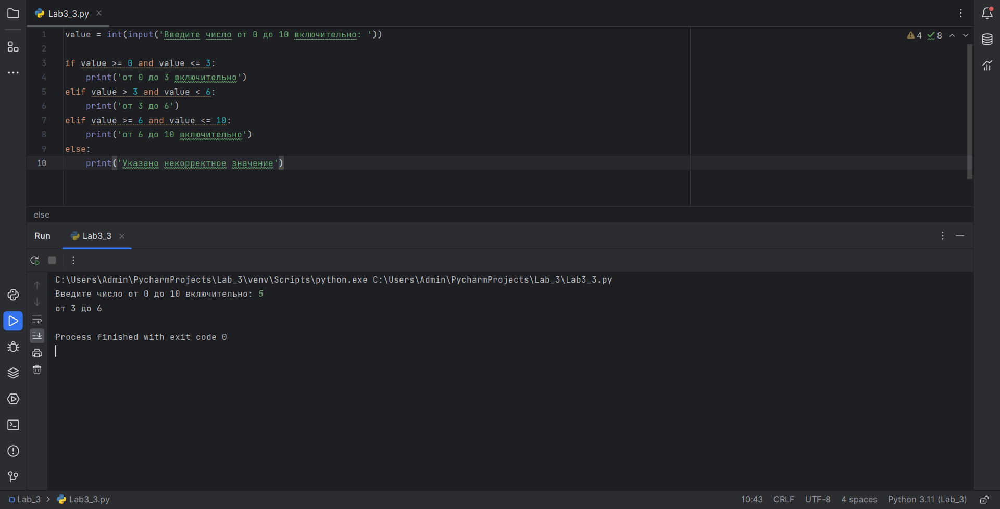
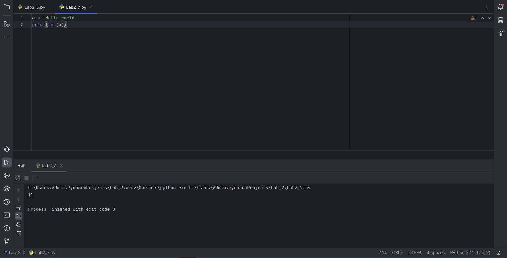

# Тема 2. Базовые операции языка Python
Отчет по Теме #2 выполнил(а):
- Плотников Иван Сергеевич
- ЗПИЭ-20-1

| Задание    | Сам_раб |
|------------|---------|
| Задание 1  | +       |
| Задание 2  | +       |
| Задание 3  | +       |
| Задание 4  | +       |
| Задание 5  | +       |
| Задание 6  | +       |
| Задание 7  | +       |
| Задание 8  | +       |
| Задание 9  | +       |
| Задание 10 | +       |
[Lab3_REPORT.md](..%2FLab_3%2FLab3_REPORT.md)
знак "+" - задание выполнено; знак "-" - задание не выполнено;

Работу проверили:
- к.э.н., доцент Панов М.А.

## Самостоятельная работа №1
### Выведите в консоль булевую переменную False, не используя слово False в строке или изначально присвоенную булевую переменную. Программа должна занимать не более двух строк редактора кода.

```python
n = 5<2
print(bool(n))
```
### Результат.


## Выводы

В данной работе я научился использовать преобразование числа `0` к булевому значению `False` при помощи функции `bool()`

## Самостоятельная работа №2
### Присвоить значения трем переменным и вывести их в консоль, используя только две строки редактора кода

```python
a = 1; b = 2; c = 3
print(a, b, c)
```


## Выводы

Я научился присваивать значения трём переменным используя только две строки редактора. Для этого необходимо объявить несколько переменных в одной строке, их нужно разделить между собой `;`. Если не указать данный разделитель, то будет ошибка `SyntaxError`

## Самостоятельная работа №3
### Реализуйте ввод данных в программу, через консоль, в виде только целых чисел (тип данных int). То есть при вводе буквенных символов в консоль, программа не должна работать. Программа должна занимать не более двух строк редактора кода.

```python
a = int(input('введите число: '))
print(a)
```



## Выводы

Я научился реализовывать ввод данных в программу в виде только целых чисел, для этого необходимо функцию `input()` обернуть в `int()`: `int(input())`. Если попробовать ввести символы отличные от букв, то будет ошибка `ValueError`
  
## Самостоятельная работа №4
### Создайте только одну строковую переменную. Длина строки должна не превышать 5 символов. На выходе мы должны получить строку длиной не менее 16 символов. Программа должна занимать не более двух строк редактора кода.

```python
str = 'Admin'
print(str, str, str, str, sep='')
```


## Выводы

Я выяснил, что в функцию `print()` можно передавать более одной переменной, поэтому при помощи строки в 5 символов на выходе мы получили строку в 20 символов

## Самостоятельная работа №5
### Создайте три переменные: день (тип данных - числовой), месяц (тип данных - строка), год (тип данных - числовой) и выведите в консоль текущую дату в формате: “Сегодня день месяц год. Всего хорошего!” используя F строку и оператор end внутри print(), в котором вы должны написать фразу “Всего хорошего!”. Программа должна занимать не более двух строк редактора кода.

```python
day = 28; month = 'сентября'; year = 2023
print(f'Сегодня {day} {month} {year}. ', end='Всего хорошего!')
```


## Выводы

Я научился использовать переменную `f` и аргумент `end`. Для того, чтобы вывести значения переменных, используется `f-строка`. А для вывода фразы "Всего хорошего" используется аргумент `end`

## Самостоятельная работа №6
### В предложении ‘Hello World’ вставьте ‘my’ между двумя словами. Выведите полученное предложение в консоль в одну строку. Программа должна занимать не более двух строк редактора кода.

```python
phrase = 'Hello World'
print(phrase.replace(' ', ' my '))
```


## Вывод
Я вставил `my` между двумя словами, для этого я воспользовался функцией `replace`. Заменим пробел на ` my `

## Самостоятельная работа №7
### Узнайте длину предложения ‘Hello World’, результат выведите в консоль. Программа должна занимать не более двух строк редактора кода.

```python
a = 'Hello world'
print(len(a))
```



## Выводы

Я выяснил, что функция `len()` позволяет узнать длину переданной строки

## Самостоятельная работа №8
### Переведите предложение ‘HELLO WORLD’ в нижний регистр. Программа должна занимать не более двух строк редактора кода.

```python
a = 'HELLO WORLD'
print(a.lower())
```


## Выводы

Я узнал, что для того, чтобы привести строку к нижнему регистру необходимо воспользоваться функцией lower()

## Самостоятельная работа №9
### Самостоятельно придумайте задачу по проходимой теме и решите ее. Задача должна быть связанна со взаимодействием с числовыми значениями.

Задача: Создайте две числовых переменных. Третья переменная это неравенство деленных этих переменных с любым числом. Выведите в консоль булевую переменную False или True для этого неравенство, не используя  слово False или True.

```python
a = 7; b = 8;
c = a/b<1
print(bool(c))
```


## Выводы

Я выяснил, что функция `bool` может проверить истинность или ложность любого значения.

## Самостоятельная работа №10
### Самостоятельно придумайте задачу по проходимой теме и решите ее. Задача должна быть связанна со взаимодействием со строковыми значениями.

Задача: Создайте переменную для ввода числа и ещё одну переменную что бы сложить вводимое число с 87. По итогу выводите результат.

```python
a = int(input('введите число: '))
b = a + 87
print(b)
```


## Выводы

Я узнал, что можно задавать математические действия прямо в переменных и складывать их с другими переменными.

## Общие выводы по теме

В ходе работы я выяснил, что язык `python` содержит много встроенных операторов и функций для работы с числами и строками:

`print()` - используется для вывода в консоль
`#` - используется для создания комментария
`lower()` и `upper()` - используется для перевода строки в нижний или верхний регистры соответственно
`+`, `-`, `*`, `**`, `/`, `//` - используется для различных арифметических операций
