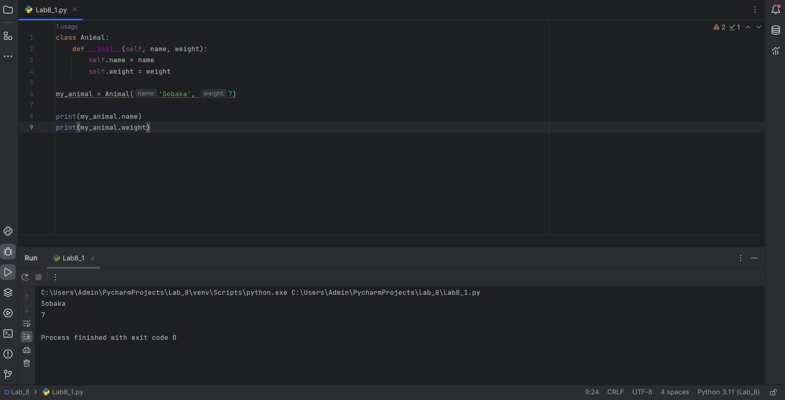
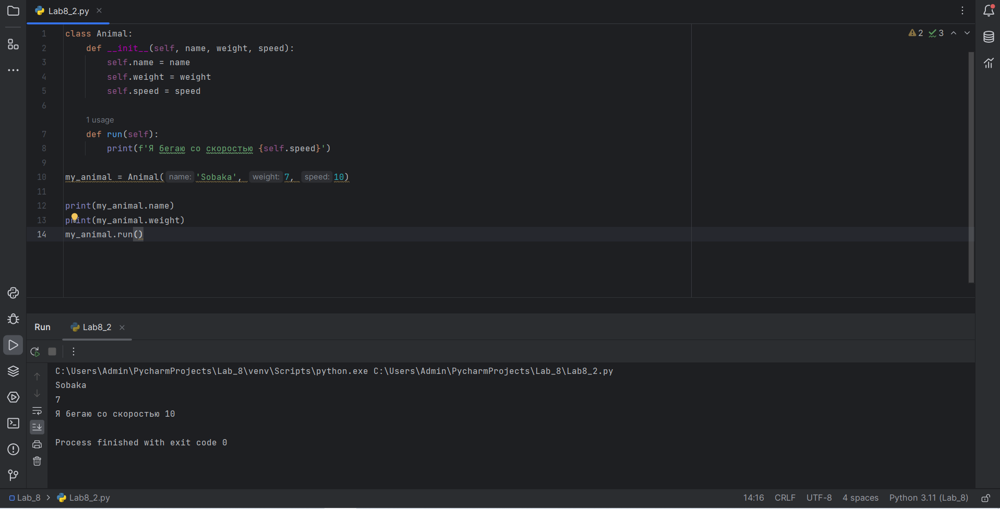
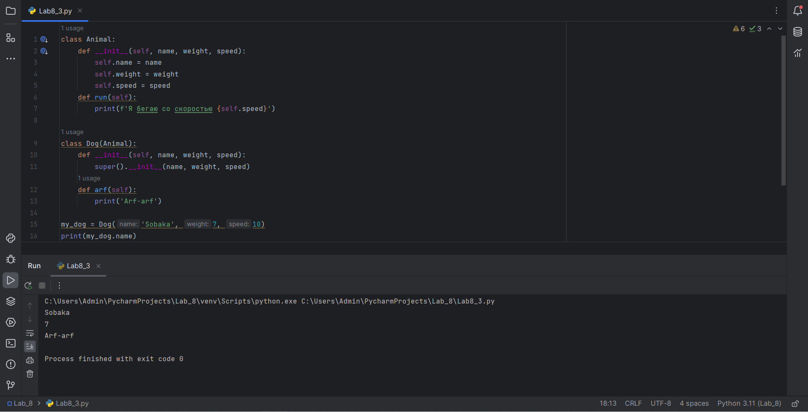
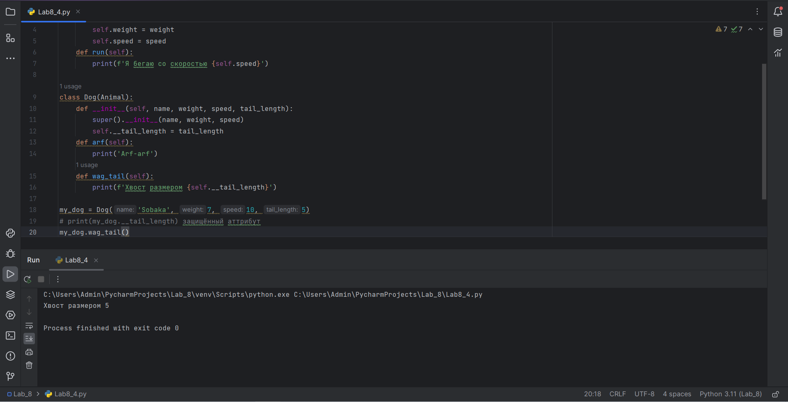
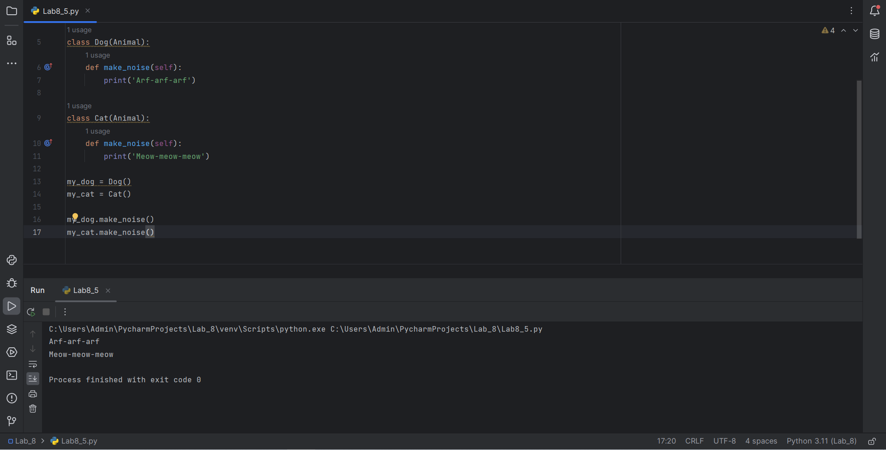

# Тема 8. Введение в ООП
Отчет по Теме #8 выполнил(а):
- Плотников Иван Сергеевич
- ЗПИЭ-20-1

| Задание    | Сам_раб |
|------------|---------|
| Задание 1  | +       |
| Задание 2  | +       |
| Задание 3  | +       |
| Задание 4  | +       |
| Задание 5  | +       |

знак "+" - задание выполнено; знак "-" - задание не выполнено;

Работу проверили:
- к.э.н., доцент Панов М.А.

## Самостоятельная работа №1
### Самостоятельно создайте класс и его объект. Они должны отличаться, от тех, что указаны в теоретическом материале (методичке) и лабораторных заданиях. Результатом выполнения задания будет листинг кода и получившийся вывод консоли.

```python
class Animal:
    def __init__(self, name, weight):
        self.name = name
        self.weight = weight

my_animal = Animal('Sobaka', 7)

print(my_animal.name)
print(my_animal.weight)
```

### Результат.



## Выводы

Я узнал, что в Python можно создавать классы и тем самым использовать парадигму ООП

## Самостоятельная работа №2
### Самостоятельно создайте атрибуты и методы для ранее созданного класса. Они должны отличаться, от тех, что указаны в теоретическом материале (методичке) и лабораторных заданиях. Результатом выполнения задания будет листинг кода и получившийся вывод консоли.

```python
class Animal:
    def __init__(self, name, weight, speed):
        self.name = name
        self.weight = weight
        self.speed = speed

    def run(self):
        print(f'Я бегаю со скоростью {self.speed}')

my_animal = Animal('Sobaka', 7, 10)

print(my_animal.name)
print(my_animal.weight)
my_animal.run()
```

### Результат.



## Выводы

Я узнал, как для класса добавить аттрибуты `speed` и `run()`, которые выводят в консоль сообщение и сообщают о скорости передвижении

## Самостоятельная работа №3
### Самостоятельно реализуйте наследование, продолжая работать с ранее созданным классом. Оно должно отличаться, от того, что указано в теоретическом материале (методичке) и лабораторных заданиях. Результатом выполнения задания будет листинг кода и получившийся вывод консоли.

```python
class Animal:
    def __init__(self, name, weight, speed):
        self.name = name
        self.weight = weight
        self.speed = speed

    def run(self):
        print(f'Я бегаю со скоростью {self.speed}')

class Dog(Animal):
    def __init__(self, name, weight, speed):
        super().__init__(name, weight, speed)

    def arf(self):
        print('Arf-arf')

my_dog = Dog('Sobaka', 7, 10)

print(my_dog.name)
print(my_dog.weight)
my_dog.arf()
```

### Результат.



## Выводы

Наследование является мощным инструментом в ООП для переиспользования и композиции кода

## Самостоятельная работа №4
### Самостоятельно реализуйте инкапсуляцию, продолжая работать с ранее созданным классом. Она должна отличаться, от того, что указана в теоретическом материале (методичке) и лабораторных заданиях. Результатом выполнения задания будет листинг кода и получившийся вывод консоли.

```python
class Animal:
    def __init__(self, name, weight, speed):
        self.name = name
        self.weight = weight
        self.speed = speed
    def run(self):
        print(f'Я бегаю со скоростью {self.speed}')

class Dog(Animal):
    def __init__(self, name, weight, speed, tail_length):
        super().__init__(name, weight, speed)
        self.__tail_length = tail_length
    def arf(self):
        print('Arf-arf')
    def wag_tail(self):
        print(f'Хвост размером {self.__tail_length}')

my_dog = Dog('Sobaka', 7, 10, 5)
# print(my_dog.__tail_length) защищённый аттрибут
my_dog.wag_tail()
```

### Результат.



## Выводы

Инкапсуляция позволяет ограничить доступ к некоторым аттрибутам класса

## Самостоятельная работа №5
### Самостоятельно реализуйте полиморфизм. Он должен отличаться, от того, что указан в теоретическом материале (методичке) и лабораторных заданиях. Результатом выполнения задания будет листинг кода и получившийся вывод консоли.

```python
class Animal:
    def make_noise(self):
        pass

class Dog(Animal):
    def make_noise(self):
        print('Arf-arf-arf')

class Cat(Animal):
    def make_noise(self):
        print('Meow-meow-meow')

my_dog = Dog()
my_cat = Cat()

my_dog.make_noise()
my_cat.make_noise()
```

### Результат.



## Выводы

Благодаря полиморфизму для разных классов у нас есть общий интерфейс

## Общие выводы по теме

Выполнив задание я узнал, что Python поддерживает классы, что позволяет писать код в парадигме ООП