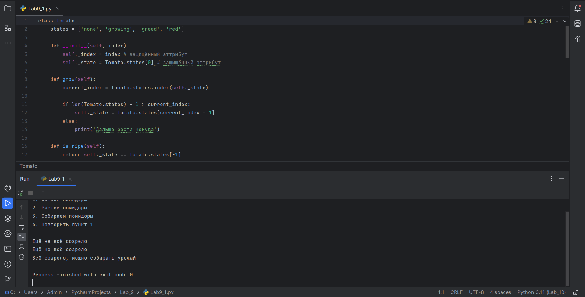

# Тема 9. Концепции и принципы ООП
Отчет по Теме #9 выполнил(а):
- Плотников Иван Сергеевич
- ЗПИЭ-20-1

| Задание    | Сам_раб |
|------------|---------|
| Задание 1  | +       |

знак "+" - задание выполнено; знак "-" - задание не выполнено;

Работу проверили:
- к.э.н., доцент Панов М.А.

## Самостоятельная работа №1
### Задание Садовник и помидоры.

```python
class Tomato:
    states = ['none', 'growing', 'greed', 'red']

    def __init__(self, index):
        self._index = index # защищённый аттрибут
        self._state = Tomato.states[0] # защищённый аттрибут

    def grow(self):
        current_index = Tomato.states.index(self._state)

        if len(Tomato.states) - 1 > current_index:
            self._state = Tomato.states[current_index + 1]
        else:
            print('Дальше расти некуда')

    def is_ripe(self):
        return self._state == Tomato.states[-1]

class TomatoBush:
    def __init__(self, count_tomatoes):
        tomatoes = []
        for i in range(count_tomatoes):
            tomatoes.append(Tomato(i))
        self.tomatoes = tomatoes

    def grow_all(self):
        for tomato in self.tomatoes:
            tomato.grow()

    def all_are_ripe(self):
        for i in self.tomatoes:
            if not i.is_ripe():
                return False

        return True

    def give_away_all(self):
        self.tomatoes.clear()

class Gardener:
    def __init__(self, name, plant):
        self.name = name # публичный аттрибут
        self._plant = plant # защищённый аттрибут

    def work(self):
        self._plant.grow_all()

    def harvest(self):
        if self._plant.all_are_ripe():
            print('Всё созрело, можно собирать урожай')
            self._plant.give_away_all()
        else:
            print('Ещё не всё созрело')

    @staticmethod
    def knowledge_base():
        print('1. Сажаем помидоры\n2. Растим помидоры\n3. Собираем помидоры\n4. Повторить пункт 1\n')

Gardener.knowledge_base()
tomato_bush = TomatoBush(1)
gardener = Gardener('Ivan', tomato_bush)
gardener.work()
gardener.harvest()
gardener.work()
gardener.harvest()
gardener.work()
gardener.harvest()
```

### Результат.



## Общие выводы по теме

В ходе выполнения задания я узнал, что концепция ООП помогает разбивать приложение на логические блоки, которые легко разрабатывать и поддерживать 